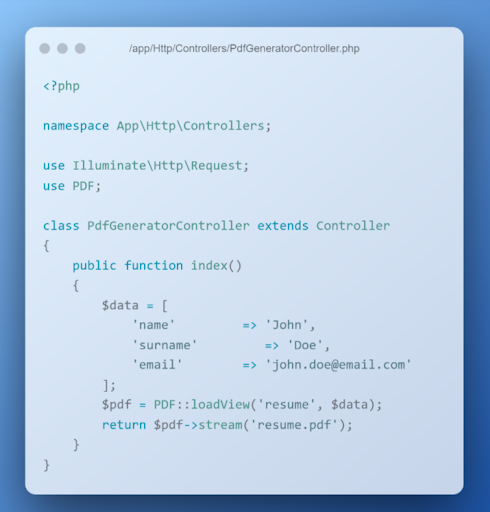

## 8. Сервисы: создание и использование
   Цели практической работы:

Научиться:

— создавать свои сервисы на Laravel;
— работать с логами Laravel и их обработкой.

Что нужно сделать:

В этой практической работе вы разработаете сервис логирования, который:
— фиксирует обращения к сайту;
— собирает их в базе данных с возможностью отключения системы логирования;
— отражает в реальном времени HTTP-запросы к приложению.

Создадим новый проект:

composer create-project laravel/laravel log-service

### 1. Для начала создадим модель логов. Для создания модели необходимо использовать artisan с параметром make:model.
   В итоге наша команда будет выглядеть так:

```php artisan make:model Log```

По умолчанию модель создаётся в ./app/Models/Log.php.
Модель создана, для избежания ошибок запросов SQL необходимо отключить автоматические метки времени.


### 2. Теперь опишем миграцию для создания нашей таблицы логов:

```php artisan make:migration create_logs_table```

Напомним, что таблицы миграции создаются по умолчанию в /database/migration/current_date_time_create_logs_table.php.

По умолчанию создаётся файл, содержимое которого выглядит так:


В этом файле нам нужно определить поля, которые будет собирать наш сервис логирования:
— time — время события;
— duration — длительность;
— IP — IP-адрес зашедшего пользователя;
— url — адрес, который запросил пользователь;
— method — HTTP-метод (GET, POST);
— input — передаваемые параметры.

В итоге файл должен приобрести такой вид:


### 3. Миграция создана, параметры описаны. Теперь создадим таблицу.

Напоминаем, что таблица создаётся также через artisan c параметром migrate php artisan migrate.

### 4. База данных подготовлена, теперь нужно создать звено (middleware) для обработки HTTP-запросов. Напоминаем, что звенья создаются при помощи команды php artisan make:middleware название модели.

В нашем случае нам нужна команда:
php artisan make:middleware DataLogger

По умолчанию звено (посредник) создастся по пути ./app/Http/Middleware/DataLogger.php.
Теперь необходимо настроить middleware. Открываем Datalogger.php. Добавим использование созданной модели.


Также нужно завершить создание middleware DataLogger, зарегистрировать его в ./app/Http/Kernel.php.


### 5. Модель создана, посредник HTTP-запросов настроен и зарегистрирован как класс в Kernel.php. Если сейчас запустить Laravel командой php artisan serv, всё будет работать. Логи будут записываться в базу данных.
   Но увидеть это можно только в самой базе SQL. Для получения более наглядных результатов необходимо создать в web.php эндпоинт.


Также для этого эндпоинта необходимо создать blade-шаблон: ./resource/view/logs.blade.php

В нём создать запрос к базе SQL и вывод логов в таблицу.


Запускаем приложение, при открытии вашего приложения http://localhost:8000/logs должна открываться таблица с логами обращения к сайту.


## 7. Формирование ответа (Response)
Цели практической работы:

Научиться:

— использовать класс Laravel Response на практике;
— создавать CRUD REST API на базе фреймворка Laravel;
— передавать данные в формате PDF в ответе экземпляра класса Response.

Что нужно сделать:

В этой практической работе вы будете разрабатывать контроллер, который позволит выводить информацию об одном и обо всех пользователях из базы данных, сохранять данные о новом пользователе в БД, а также создавать PDF с информацией о пользователе.
### 1. Установите новое приложение Laravel и настройте подключение к базе данных. Напомним, что создать новое приложение можно с помощью команды composer:

```composer create-project laravel/laravel crud```

Добавьте необходимые переменные окружения в ENV-файл корневого каталога приложения.

 

### 2. Создайте новую модель Eloquent c помощью команды:

```php artisan make:model User -mfsc```

Напомним, что флаг -mfsc создаст модель, наполнитель, контроллер и файл миграции.
После опишите схему базы данных в методе up() файла .app/Http/Models/User.php.


После описания схемы таблицы базы данных запустите миграцию.

### 3. Создайте необходимые роуты в файле web.php. Ваше приложение должно содержать минимум четыре эндпоинта:
   — для получения всех пользователей из БД;
   — получения одного пользователя через id, переданный в параметрах роута;
   — записи нового пользователя в базу данных;
   — получения данных о пользователе в виде PDF-файла.


### 4. Создайте новый blade-шаблон. В blade-шаблоне создайте форму, которая будет отправлять данные о работнике. Важно, чтобы поля HTML-формы были сопоставимы с полями таблицы базы данных. При отправке запроса экземпляр класса request должен содержать данные об имени, фамилии и адресе электронной почты пользователя.
   Форма blade-шаблона должна содержать CSRF-токен, поля формы должны быть обязательны к заполнению (используйте атрибут required).


### 5. В контроллере UserController.php опишите функцию store, которая будет сохранять данные из вашей HTML-формы. Добавьте валидацию.


Дополнительно. Добавьте валидацию на количество символов (максимальное количество символов — 50) для полей Name и Surname. Для почты добавьте валидацию в виде регулярного выражения на соответствие виду example@mail.com.


### 6. Добавьте соответствующие методы index и get, которые будут возвращать данные обо всех пользователях и об одном пользователе по переданному id. Опционально можете возвращать ответ в формате JSON.

### 7. Чтобы генерировать PDF-документ, вам понадобится DOMPDF-пакет, который является сторонней библиотекой. Для его установки выполните команду:

```composer require barryvdh/laravel-dompdf```

— В файле composer.json добавьте строку с указанным пакетом.
— Запустите команду composer update.
— Добавьте необходимый Service Provider и Facade в файл config/app.php.


### 8. Создайте новый контроллер для работы с PDF:

```php artisan make:controller PdfGeneratorController```

### 9. Опишите функцию index, которая будет возвращать новый PDF-файл.



### 10. Измените роут Route::get(‘/resume’) таким образом, чтобы он принимал id в виде параметра. Обновите функцию «index» так, чтобы PDF формировался на основе данных из таблицы по переданному id.
